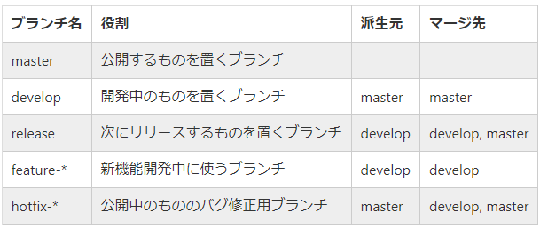

# How to contribute

## コーティング規約

大きな制約はありません。

### コマンドの実装

コマンドは基本的に Slash Command などのApplication Commandを始めとするInteractions APIで実装してください。

`*help`・`メンションヘルプ` のみはテキストでのコマンド実装になっています。これはSlash Commandを使わずに使用している人への対応策です。

これはDiscord Bot & API Teamが2022年春より施行する [認証済みbotのためのメッセージコンテンツのアクセス廃止](https://support-dev.discord.com/hc/ja/articles/4404772028055) に伴う回避策のためです。(今のところは100サーバー以上に導入されていてインテントの認証を必要とするBotのみですが、今後通常Botのアクセス廃止も考えての規約です。)

## ブランチ命名

(MessageQuoteには`release`などのブランチは用意していないので派生先やマージ先は気にしないで大丈夫です。)

## huskyによるコミット時の自動FIX

huskyによりコミット時に自動でFixが走るようになっています。
