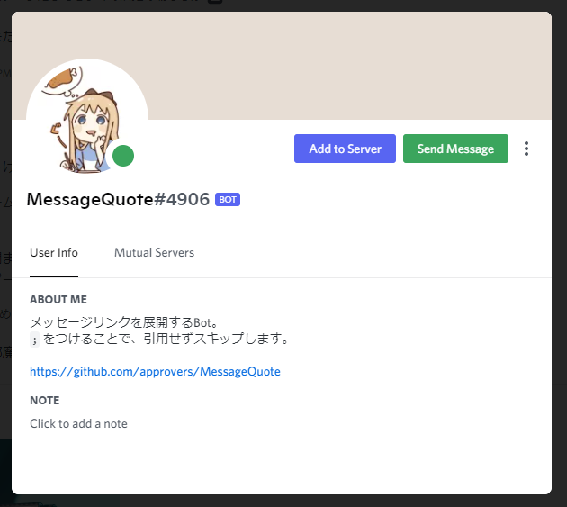

# MessageQuote

[](https://github.com/approvers/MessageQuote/actions/workflows/codeql-analysis.yml)
[](https://github.com/approvers/MessageQuote/actions/workflows/eslint.yml)
[](https://github.com/approvers/MessageQuote/actions/workflows/prettier.yml)

メッセージリンクからIDを取得して引用できるDiscord Bot

TypeScriptとDiscord.jsを使い、メッセージIDからDiscord APIでメッセージを取得しています。

----

## 導入する

ホストせず使う場合は [このURL](https://discord.com/api/oauth2/authorize?client_id=889343802433757185&permissions=274877914112&scope=bot%20applications.commands) から導入できます。

Botのプロフィールから直接導入も可です。



### 自分でホストする

node.jsの最新版をセットアップしてください。

```
git clone https://github.com/approvers/MessageQuote.git
yarn
echo .env >> TOKEN=
yarn compile
yarn start
```

<details>
<summary>アップデート方法</summary>

[Releases](https://github.com/approvers/MessageQuote/releases) が更新されたらアップデートを行うことを推奨します。

```
git pull
yarn
yarn compile
yarn start
```

</details>

### 寄稿者など
- [mirror-kt](https://github.com/mirror-kt)
- [isso0424](https://github.com/isso0424)
- [loxygenK](https://github.com/loxygenK)
- [watano1168](https://github.com/watano1168)
- [MikuroXina](https://github.com/MikuroXina)
- [skytomo221](https://github.com/skytomo221)

----

| 値                 | 概要                      |
|-------------------|-------------------------|
| TOKEN             | DiscordのBotのToken       |
| STATUS_CHANNEL_ID | ステータスメッセージを送信するチャンネルを指定 |
