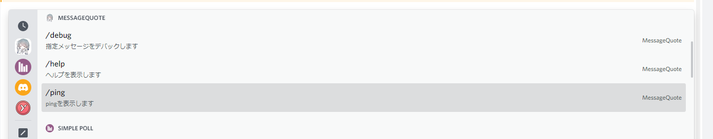

# Application (/) Commandのセットアップ

Slash (/) Commandをセットアップします。

## Guild Commandとしてセットアップする

一つのギルドだけしか使わない予定の場合はGuild Commandとしての登録を行います。

Guild Commandは指定したギルドでのみ有効になります。そのBotが他のGuildに行ってもSlash Commandは使えません。(そこでも設定が必要になります。)

1. `.env` を編集する

```dotenv
DISCORD_TOKEN=
TARGET_GUILD_ID=
CLIENT_ID=
```

- Guild Commandで登録を行う際は3つの値が必要になります。
- `DISCORD_TOKEN` はBotのDiscord API Tokenです。
- `TARGET_GUILD_ID` は今回Guild Commandを登録したいGuildのIDを指定します。
- `CLIENT_ID` はBotのClient IDです。(ユーザーIDと同じです。)

2. Botを再導入する

- [Discord Developer Portal](https://discordapp.com/developers/applications) に移動し、導入するBotのOAuth2 URL Generatorへ移動します。
- `SCOPES` という欄から `bot`, `applications.commands` を選択します。
- `BOT PERMISSIONS` はいつもどおりに権限を選択します。
- すべて選び終わったら導入します。

3. コンパイルを行う

`yarn compile` を実行します。

4. デプロイを行う

`yarn deploy` を実行します。

```shell
Start: deploying application (/) commands.....
End: deploy application (/) commands in GuildCommand.
Done in 0.82s.
```

上記のログが出たらクライアントから確認してみましょう。
指定したGuildで `/` と入力し、このような画面が出てきたら成功です。



## Global Commandとしてセットアップする

他のGuildでも使う際はGlobal Commandとしての登録を行います。

Global Commandで登録した際はBotが他のGuildでも同じSlash Commandが使用できます。

ただし注意点として、Guild CommandはDiscord APIへのデプロイ等で、1時間以上クライアントへの反映に時間がかかります。その際にGuild Commandで登録しようとはしないでください。

Guild CommandとGlobal Commandは全く違うものになっているのでクライアント上で2つのコマンドが表示されてしまいます。

> このような状況になってしまったら一度BotをKickし、再招待を行ってください。

1. `.env` を編集する

```dotenv
DISCORD_TOKEN=
CLIENT_ID=
```

- Guild Commandで登録を行う際は2つの値が必要になります。
- `DISCORD_TOKEN` はBotのDiscord API Tokenです。
- GuildCommand登録時に使用した `TARGET_GUILD_ID` は今回なしにします。指定するとGuild Commandとしての登録になります。
- `CLIENT_ID` はBotのClient IDです。(ユーザーIDと同じです。)


2. Botを再導入する

- [Discord Developer Portal](https://discordapp.com/developers/applications) に移動し、導入するBotのOAuth2 URL Generatorへ移動します。
- `SCOPES` という欄から `bot`, `applications.commands` を選択します。
- `BOT PERMISSIONS` はいつもどおりに権限を選択します。
- すべて選び終わったら導入します。

3. コンパイルを行う

`yarn compile` を実行します。

4. デプロイを行う

`yarn deploy` を実行します。

```shell
Start: deploying application (/) commands.....
End: deploy application (/) commands in GlobalCommand.
Done in 0.82s.
```

上記のログが出たらクライアントから確認してみましょう。
指定したGuildで `/` と入力し、このような画面が出てきたら成功です。

